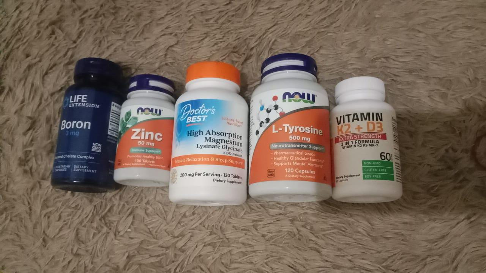

## Introduction

I have been skinny-bro since elementary, it made me insecure. I tried to eat more than i usually ate and still can't gain weight. So i have been hopeless in gaining weight since then. But now that i have more money ~~my parents's money~~ i can buy it with no worries being lectured by my parents because i lived on a rent house.

I'm 5'7" 110lbs 20M, with no disabilities or any other health issues,, maybe. In my 12-16, i often got diarrhea and it fucking suck. When i thought i'm gonna gain weight and diarrhea just got me out of nowhere, i don't know why i always got it when gained little weight. It made me depressed that i can't gain weight like my friends did. So i waited for the time that i live on my own so that i can buy what my body needs, i'm guessing that i have deficiency on something but i don't know what is it.

Until, i found out that i'm deficient in zinc and magnesium when i visited a healthcare. I don't know what kind machine it is, its like a sensor device that you put on chest. After i know that, i bought zinc 50mg NOW brand and magnesium 200mg DrBest's. After taking it like 4 months my body feels so different than i was.

## My supplements stack

I've been taking 5 supplements that I bought from Tokopedia ~~an online shop in indonesia~~.

 

- [Zinc 50mg NOW brand](https://tk.tokopedia.com/ZSBHDf8UK/)
- [Magnesium glycinate DrBest's](https://tk.tokopedia.com/ZSBHDuwDM/)
- [Boron 3mg LifeExtension](https://tk.tokopedia.com/ZSBHDXyqM/)
- [VitD 10k + K2 Bronson](https://tk.tokopedia.com/ZSBHDuxb5/)
- [L-Tyrosine 500mg NOW brand](https://tk.tokopedia.com/ZSBHDS7h6/)

## I'm still growing!

I can feel my body is growing a lot faster now. you might be thinking this is a placebo, and you probably right. But I seriously got more
strength and muscle after taking these 4 months, my gym performance skyrocketing about 20%. and it is a lot for me that can't lift 5kg before.
Now that I feel great everyday, I'm gonna seriously cooding until I get job. Thanks for reading my TEDTalk.
